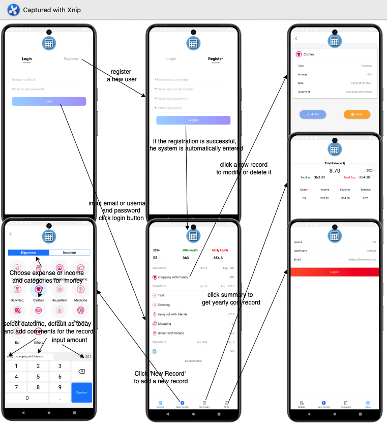

# Daily Cost Tracker
The Daily Cost Tracker App is a mobile application designed to help users track their daily expenses and manage their finances effectively. This repository contains the source code and instructions for setting up and running the app.
## Getting Started
To get started with the Daily Cost Tracker App, follow these steps:
### Prerequisites
- Java (version 1.8 or later)
- Springboot  (version 2.2.0 or later)
- Maven (version 3.8.1 or later for back-end build tool)
- Gradle (version 6.1.1 or later for front-end build tool)
- Android (version 12 as target)
- Vue (version 2.6.11)
- Vant (version 2.13.2)
## Repository Structure

The repository is organized into three main folders:
### 1. `mobile`

This folder contains the source code for the mobile client application, built using Android 12 SDK and Gradle. The client provides an android client for user.

### 2. `client`

This folder contains the source code for the webpages, built using Vue2. It provides the UI pages for user.

### 3. `server`

This folder contains the source code for the back-end service, built using Spring Boot. The server application handles data storage, user authentication, and API endpoints for the front-end to interact with.

## Snapshots

## License

The Daily Cost Tracker App is released under the [MIT License](LICENSE).