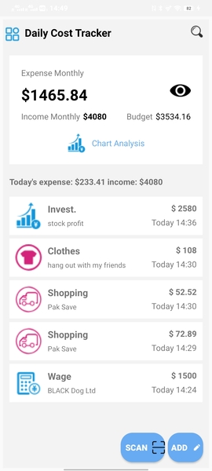
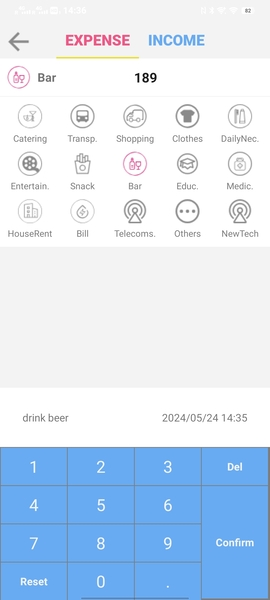
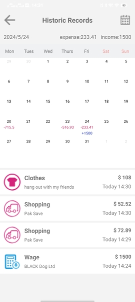
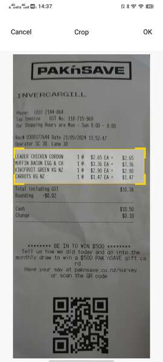
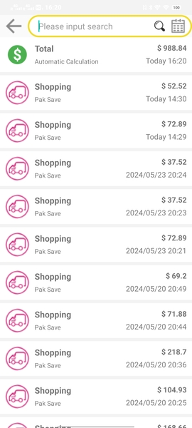

# Daily Cost Tracker
The Daily Cost Tracker App is a mobile application designed to help users track their daily expenses and manage their finances effectively. This repository contains the source code and instructions for setting up and running the app.
## Getting Started
To get started with the Daily Cost Tracker App, follow these steps:
### Prerequisites
- Java (version 1.8 or later)
- Gradle (version 6.1.1 )
- Android (minSdkVersion 16 and targetSdkVersion 31)
- Python  (version 3.8.19 or later)
- PaddleOcr (version 2.6.1 or later for back-end ocr service)
- pywsgi.WSGIServer(24.2.1),Flask(3.0.3) 
## Repository Structure

The repository is organized into two main folders:

### 1. `client`

This folder contains the source code for the mobile client application, built using Android 31 SDK and Gradle. The client application is responsible for the user interface, expense tracking, and communication with the back-end server.

### 2. `server`

This folder contains the source code for the back-end service. The server application provides API endpoints for the mobile client to recognise receipt.

## Snapshots
  

  

  
## License

The Daily Cost Tracker App is released under the [MIT License](LICENSE).